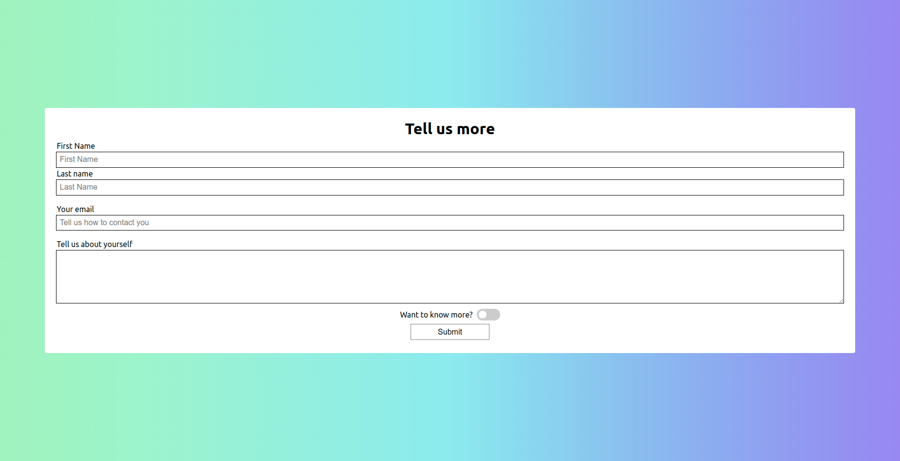
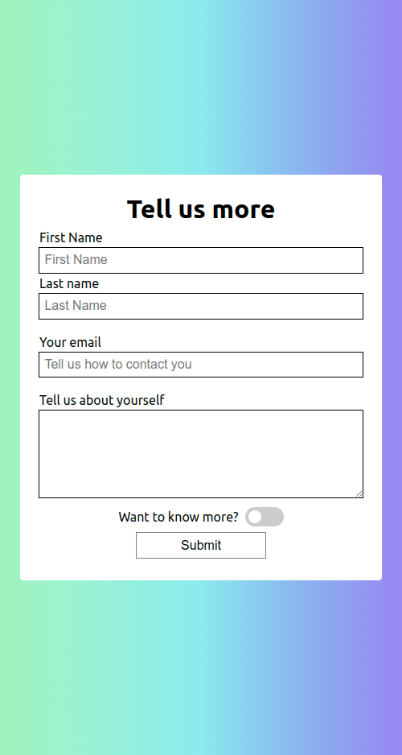

# Gradient Feedback Form

## Exercise Course-Module 1 - UserInterfaceBasics (UIB) - HTML/CSS

### Basic Data Exercises - Styling Forms

created at 20.09.22;

Created a responsive form, styled like the mockup/reference image in the images-folder, with first name, last name, email and message fields required in order to submit the form; with minimum length to the first name, last name and email address inputs and maximum length to the text field; allowing users to submit a form using `formspree.io`.

#### My desktop version:

#### My mobile version:

#### Mockup

